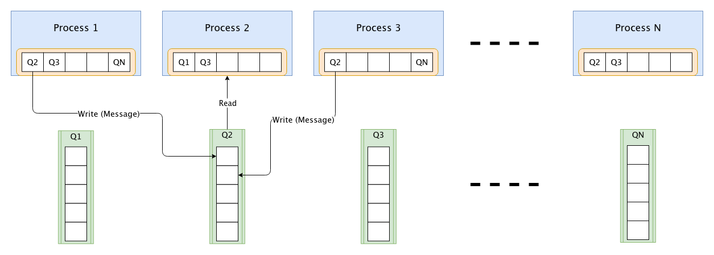

# Distributed-GHS
Repository to hold the implementation for computing the Minimum Spanning Tree using GHS Algorithm in a distributed fashion, as part of assignment for course [COL819 - Spring 2020](http://www.cse.iitd.ac.in/~srsarangi/courses/2020/col_819_2020/index.html) at IIT Delhi.

## Repository Structure
.  
├── generate.py  
├── main.py  
├── modules  
│   ├── __ init__.py  
│   ├── kruskals.py  
│   ├── plot.py  
│   └── utils.py  
├── node.py  
├── README.md  
└── run_exp.sh  

For further details, check the docstring in each of the python files.

## Experiments
### How to run

```bash
python main.py <processes-to-wake-up> <debug-level> <path-to-input-file>
```

#### Parameters
The parameters are as follows:
* No. of processes to wake up - This is the number of initial processes that should be woken up at the initiation of the algorithm. To ensure flawless execution, it is made compulsory that atleast 10% of the total nodes must be awakened. If this number is less than this threshold, the code automatically wakes up 10% of the nodes.
* Debug Level - The code takes as input the verbosity level of the logs that should be displayed. `basic` is the level at which only the console output is printed. `info` level prints some more information so that the progress of the algorithm can be tracked. `debug` level prints all information of receiving, processing and sending messages.
* Input File - This is the path of the input file, which contains description of the graph.  

### Test Case Generation
```bash
python generate.py <num-nodes-to-generate> <graph-type>
```

#### Parameters
* Num nodes to generate - Number of nodes that should be in the network
* Graph type - The argument graph-type can be either `tree`, `linear`, `ring`, `random` or `connected`, implying the type of graph that it should generate. `random` generates a random number of edges, and `connected` generates a fully connected graph.

### Running Multiple Experiments
The repo also comes bundled with a shell script to run multiple runs of the script and to log the output, in case any error occurs:
```bash
./run_exp.sh <num-times-to-execute> <input-file> <number-of-nodes> <timeout-in-seconds>
```

## Implementation
The Distributed GHS Algorithm is implemented in Python using the Python Multiprocessing module, which gives extremely useful wrappers for important system calls, and message passing interfaces.

### Message Passing Interface - Message Queues
#### Multiprocessing vs Multi-threading
Each node of the graph is simulated as a separate Process using the Python [Multiprocessing](https://docs.python.org/3.7/library/multiprocessing.html) module. This implementation is **preferable** over [Multithreading](https://docs.python.org/3.7/library/threading.html) constructs because, each process is spawned with a separate memory space and therefore, a more realistic simulation is implemented compared to the multi-threading case, where threads can use shared memory for communication. In real world scenarios too, the different nodes do not have access to each others’ memory space.

#### Message Queues vs Pipes
In the current implementation of the GHS Algorithm, message passing is implemented through **Message Queues** ([wiki](https://en.wikipedia.org/wiki/Message_queue)). The other alternative could have been **Pipes** ([wiki](https://en.wikipedia.org/wiki/Pipeline_(Unix))) for communication between processes. Multiple processes can write simultaneously to a single queue, which can then be read by a process. However, for a pipe, only a pair of processes can use it at a time for communication. Hence, an implementation where a single Message Queue attached to each process is used. This considerably enhances the ease of implementation and reduces the efforts of reading through multiple pipes.

### Message Passing Implementation
The current implementation uses a single message queue for each process. Each process reads from its respective message queue, and writes to the message queues of its neighbors as shown in the figure.


#### Message Definition
The following code snippet shows how messages are wrapped in a dictionary object to send across a queue:
```python
# Function in Node Class
def __edge_stub(self, edge_index, message, payload=[], sender_edge=-1):
    """Act as a stub to write to the given edge

    Arguments:
        edge_index {Integer} -- Index of the edge on which message is to be written,
                                if -1 write to self queue
        message {Message} -- Message
        payload {List} -- Attached Payload
        sender_edge {Integer} -- Edge index through which the message is set to be read,
                                 -1 if to be sent from current edge
    """
    if edge_index == -1:
        # Write to its own queue
        edge_id = self.edges[sender_edge].get_id()
        obj = {'sender': edge_id, 'message': message, 'pl': payload}
        self.msg_q.put(obj)
    else:
        self.num_messages += 1
        self.edges[edge_index].write(message, payload)

# Function in Edge Class
def write(self, message, payload):
    """Write to the given edge by the node specified in the arguments

    Arguments:
        node {Integer} -- Node id of the sender node
        message {Message} -- Message to be sent
        payload {List} -- List of arguments sent along with message
    """
    # Find the queue to write to
    obj = {'sender': self.get_id(), 'message': message, 'pl': payload}
    self.queue.put(obj)
```
The function [Node.__ edge_stub()](https://github.com/DivyanshuSaxena/Distributed-GHS/blob/master/node.py#L90) is used by each of the processes (nodes) to send messages to its neighbours. The same function is also used by the process to send a message, deferred by a process, back to the queue. Also note that each message passed across two processes, is encapsulated in a dictionary object in the [Edge.write()](https://github.com/DivyanshuSaxena/Distributed-GHS/blob/master/modules/utils.py#L82) function.

### Termination
Apart from the Messages mentioned in the paper, the current implementation also utilizes another `Halt` message, to notify processes that the Minimum Spanning Tree has been computed and they can hence, complete their execution. Check in the function [Node.__ complete()](https://github.com/DivyanshuSaxena/Distributed-GHS/blob/master/node.py#L160).

### Verification
For verifying the correctness of the output produced by the implementation of the Distributed GHS algorithm, the weight of the final MST generated by the algorithm is matched by the weight of an independent running Kruskal’s Algorithm [implementation](modules/kruskals.py). This result is asserted in the [main.py](main.py) file as well:

```python
# Check weight with the tree from kruskals algorithm as well
weight = print_output(raw_edges, mst)
k = Kruskals(num_nodes)
k_weight = k.get_mst(raw_edges)

assert weight == k_weight, '[CHECK]: Weights from Kruskals and GHS do not match'
```

## Contributing

Feel free to fork, make your changes and submit a pull request on this repo.
